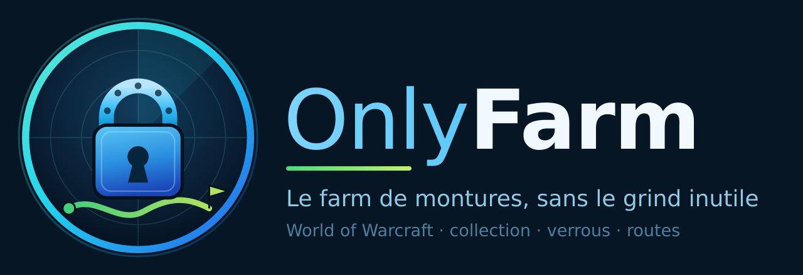

<p align="center">
  
</p>

# OnlyFarm

Addon World of Warcraft (Retail) qui répond à une question : **qu'est-ce que je
fais cette semaine pour choper des montures, et dans quel ordre ?**

État : **phase 1 (socle)**. Diff de collection, verrous et disponibilité
multi-personnage fonctionnent. Les routes arrivent en phase 3.

## Ce que ça fait aujourd'hui

* **Tableau de bord** : compteurs, progression par extension (les moins
  avancées en tête), répartition de ce qui est ouvert / verrouillé / inconnu,
  cibles à lancer maintenant, et la liste des raids déjà faits cette semaine
  avec leur temps avant reset.
* Liste des montures qui te manquent **et que ce personnage peut obtenir** —
  les montures d'une autre faction ou d'une autre classe sont écartées, pas
  comptées comme « manquantes ».
* **Compteur de tentatives** par monture : tuer un boss incrémente les montures
  qu'il peut lâcher. Maj+clic sur une ligne ajoute une tentative à la main,
  Ctrl+clic en retire une.
* Pour chaque monture, sa source telle que le jeu la décrit, et son statut :
  disponible, verrouillée avec le temps avant reset, ou honnêtement
  « incertain » quand l'addon ne sait pas encore.
* Vue multi-personnage en infobulle : sur quels persos la cible est encore
  ouverte cette semaine. Un perso pas connecté depuis plus de 7 jours est
  marqué incertain plutôt que présenté comme fiable.
* Suivi des entrées d'instance, avec le compteur du cap 10/heure — 30/jour.

## Installation

Cloner (ou copier) le dépôt dans le dossier des addons, sous le nom `OnlyFarm` :

```
World of Warcraft/_retail_/Interface/AddOns/OnlyFarm/
```

Le nom du dossier doit correspondre à `OnlyFarm.toc`, sinon le client ignore
l'addon.

## Commandes

| Commande | Effet |
|---|---|
| `/of` | ouvrir la fenêtre |
| `/of scan` | forcer un rescan : collection, verrous et cartographie |
| `/of chars` | lister les personnages connus et leurs verrous |
| `/of deepscan` | passe approfondie : butin boss par boss (lent, facultatif) |
| `/of diag` | dire pourquoi la cartographie est revenue vide |
| `/of export` | CSV des montures sans extension (outil de mainteneur) |
| `/of debug` | activer les traces |
| `/of reset` | effacer la base sauvegardée (confirmation requise) |

### La cartographie des montures

L'addon connaît les montures qui te manquent dès l'installation. Savoir à
quelle extension elles appartiennent et dans quelle instance elles tombent
demande une passe supplémentaire : c'est la **cartographie**.

**Tu n'as rien à lancer.** Elle part toute seule quelques secondes après la
première connexion, puis **elle est gardée sur le disque** (SavedVariables).
Elle ne se refait que dans deux cas : le build du client a changé (un patch), ou
le client expose plus de montures qu'au dernier passage. Le bouton
« Rescanner » du tableau de bord la force à la main.

Elle se fait en deux temps :

1. **l'index des instances** — construit à partir de *deux* sources : la liste
   des donjons du Recherche de groupe (des globales toujours présentes, qui
   portent le niveau d'extension) et, quand il répond, le parcours par paliers
   du Journal des rencontres (qui apporte en plus l'identifiant reliant une
   instance à son entrée sur la carte). Si l'une est muette, l'autre suffit ;
2. **le texte de source** — chaque monture expose déjà
   `Butin : Le roi-liche|nCitadelle de la Couronne de glace`. On le découpe, et
   on rapproche le lieu de l'index.

Si la cartographie revient vide, **`/of diag`** dit lequel des quatre maillons
a cédé : les paliers, la liste du Recherche de groupe, le découpage du texte,
ou le rapprochement des noms.

Une troisième passe, **`/of deepscan`** (bouton « Scan approfondi »), parcourt
le butin boss par boss pour affiner les cas que le texte de source décrit mal.
Elle est lente et facultative : la version 0.1.0 en dépendait entièrement, et
c'est ce qui laissait l'addon muet quand l'API de butin ne répondait pas.

Le résultat brut part aussi dans `OnlyFarmScanDB`, qui alimentera le générateur
de données de la phase 2.

### Ce que le client ne dira jamais

La cartographie dérivée du client suit les patchs toute seule, mais elle bute
sur un mur : **le client n'expose pas l'extension d'une zone**. Les montures de
vendeur, de métier, d'événement saisonnier, de PvP ou de butin de zone n'ont
donc aucun rattachement possible par API — leur texte de source ne cite qu'un
PNJ ou un lieu. Elles restent dans le panier « inconnue », et l'addon le dit
plutôt que de deviner.

Ce trou se comble par une table livrée avec l'addon, préparée au moment du
build (voir plus bas). **Rien à faire de ton côté** : elle est dans le dossier
que tu as copié.

## Développement

```bash
./scripts/check.sh     # syntaxe Lua 5.1 + tests headless
```

* [`CONTRIBUTING.md`](CONTRIBUTING.md) — conventions, règles du domaine, décisions prises.
* [`docs/SPEC.md`](docs/SPEC.md) — spécification fonctionnelle complète.
* [`docs/API-NOTES.md`](docs/API-NOTES.md) — signatures d'API vérifiées contre
  le client 12.0.7, et les endroits où la spécification est fausse.

Les tests tournent hors du jeu grâce à un client simulé
(`Tests/wow_stub.lua`) : ils couvrent la logique, pas le rendu. Pour l'interface
il n'y a pas de raccourci — charger l'addon en jeu avec **BugSack + BugGrabber**
et lire les erreurs.

### Préparation des données (mainteneurs uniquement)

> **Un joueur n'a RIEN à installer ni à configurer.** Un addon WoW ne peut
> émettre aucune requête réseau : c'est une contrainte du client. Toute donnée
> extérieure est donc compilée en `.lua` au moment du build, committée dans le
> dépôt, et livrée avec l'addon — au même titre que les textures. Les outils
> ci-dessous sont l'équivalent d'un compilateur : indispensables pour produire
> la release, invisibles pour qui l'utilise.

Créer le client OAuth sur <https://develop.battle.net/access/clients> :

| Champ | Quoi mettre |
|---|---|
| **Client Name** | un nom **globalement unique** sur tout Battle.net — `OnlyFarm` seul sera probablement refusé, préférer `OnlyFarm-<pseudo>` |
| **Redirect URLs** | **vide**. Ce champ ne sert qu'au flux « authorization code », où un joueur se connecte avec son compte. On utilise `client_credentials`, qui n'en a pas besoin |
| **Service URL** | cocher **« I do not have a service URL for this client »** : il n'y a pas de service, seulement un script local |
| **Intended Use** | décrire l'usage réel (voir ci-dessous) |

Texte proposé pour *Intended Use* :

> Local build script for OnlyFarm, an open-source World of Warcraft addon.
> It runs on my own machine a few times per patch and reads static game data
> only (/data/wow/mount/index and /data/wow/mount/{id}) to compile a mount
> reference table that ships inside the addon. No player or account data is
> accessed, nothing is hosted, and no end user interacts with this client.

Après **Save**, Battle.net affiche un **Client ID** et un **Client Secret**.
Le secret ne se committe jamais et ne se partage pas : il donne accès à l'API au
nom de son propriétaire.

Créer `Build/blizzard-credentials.txt` avec ces deux lignes — le fichier est
ignoré par git :

```
BLIZZARD_CLIENT_ID=ton_client_id
BLIZZARD_CLIENT_SECRET=ton_client_secret
```

Il faut **Python 3** (`python3 --version` ; sous Windows, `py --version`). Puis,
depuis la racine du dépôt :

```bash
# 1. vérifier ce que l'API renvoie réellement, sans rien écrire
python3 Build/fetch_blizzard.py --region eu --locale fr_FR --raw 3

# 2. récupérer toutes les montures dans Build/overlay/mounts.csv
python3 Build/fetch_blizzard.py --region eu --locale fr_FR

# 3. compléter la colonne « expansion » du CSV (voir ci-dessous)

# 4. compiler la table livrée avec l'addon
python3 Build/generate_data.py Build/overlay/mounts.csv
```

Les variables d'environnement `BLIZZARD_CLIENT_ID` / `BLIZZARD_CLIENT_SECRET`
restent acceptées et priment sur le fichier.

La clé de jointure est le **mountID** — celui qu'utilisent à la fois
`C_MountJournal` et `/data/wow/mount/{id}`. Jamais le nom : les noms sont
localisés, une liste extérieure est écrite dans une seule langue, et un
rapprochement par nom marcherait chez celui qui le teste puis échouerait chez
tous les autres.

**Ce que l'API officielle donne, et ce qu'elle ne donne pas.** Elle donne la
liste canonique des montures avec leur mountID, leur nom **dans toutes les
locales**, la source déclarée par Blizzard et la faction. Elle ne donne **pas**
l'extension : aucun champ, sur aucun endpoint des montures. Son apport réel est
donc ailleurs — elle rend utilisable n'importe quelle liste communautaire
écrite en anglais sur un client français, en passant par le mountID. La colonne
`expansion` reste à remplir, à la main ou depuis une source communautaire.

`/of export` produit le même CSV depuis le jeu, restreint aux montures encore
sans extension : c'est le plus court chemin pour ne travailler que sur ce qui
manque réellement.

La table curée ne prime jamais sur ce que le client sait : elle ne s'applique
qu'aux montures pour lesquelles aucune source dérivée n'a répondu.

Les valeurs communautaires (Wowhead, warcraftmounts.com et équivalents) sont
des estimations maintenues par des joueurs. Si tu en importes, crédite-les ici
et présente les taux de drop comme des estimations.
